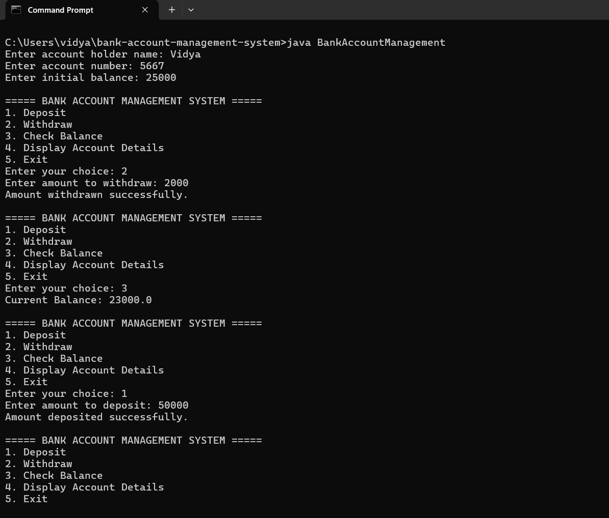

# Bank Account Management System
A console-based banking application developed in Java to demonstrate core Object-Oriented Programming concepts.
## Overview
The Bank Account Management System allows users to create a bank account and perform basic banking operations through a menu-driven interface.
The project focuses on applying Java fundamentals and OOP concepts to a practical use case.

## Features
- Create a bank account
- Deposit money
- Withdraw money
- Check account balance
- Display account details
- Validate deposit and withdrawal amounts
- Prevent withdrawals exceeding the available balance
- Menu-driven console interface
- 
## Technologies Used
- Java
- Object-Oriented Programming
- Java Scanner
- Conditional Statements
- Switch Case
- Loops
- Methods
- Constructors

## OOP Concepts Demonstrated

### Class and Object
The `BankAccount` class represents a bank account, while objects are created from the class to store account information.
### Constructor
A constructor initializes the account holder's name, account number, and initial balance.
### Encapsulation
Account-related data and operations are grouped together within the `BankAccount` class.
### Methods
Separate methods are used for operations such as:
- `deposit()`
- `withdraw()`
- `checkBalance()`
- `displayAccount()`

## Project Structure
```text
Bank-Account-Management-System/
│
├── BankAccountManagement.java
└── README.md
## Demo



## Future Improvements
- Support multiple bank accounts
- Add account search functionality
- Add transaction history
- Implement file/database storage
- Develop a graphical user interface
- Add stronger input validation

## Author
Vidya Madabattula 

## Demo

